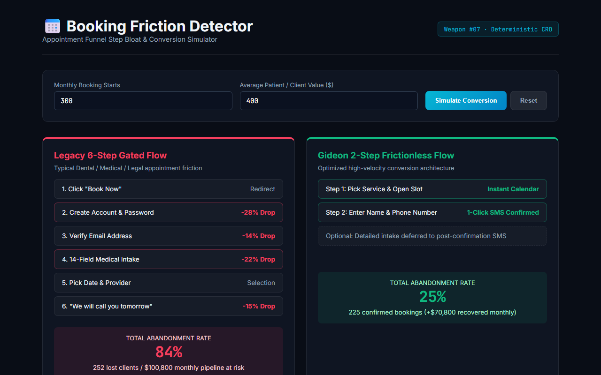

# Booking Friction Detector (Weapon #07 in the Master 50 Arsenal)

> **Appointment Funnel Step Bloat & Drop-Off Analyzer: Audits client booking flows, eliminates mandatory account creation walls, and models conversion lift from transitioning 6-step gated funnels into frictionless 2-step architectures.**

[](test/booking-friction.test.js)
[]()

---

## 🚀 Live Interactive Simulator & Proof

[](https://gideonbawa-website.netlify.app/simulators/booking-friction-detector/)

* 🌐 **Live In-Browser Simulator:** [https://gideonbawa-website.netlify.app/simulators/booking-friction-detector/](https://gideonbawa-website.netlify.app/simulators/booking-friction-detector/)
* 💼 **Portfolio Showcase:** [https://gideonbawa-website.netlify.app/#work](https://gideonbawa-website.netlify.app/#work)
* 🛡️ **Verified QA Evidence:** HMAC-SHA256 Signed Contract (`ev-qa-contract-1791285928367-booking-friction-detector`)

---


## 💸 Problem & Economic Pain
A dental clinic, medical practice, or consultancy forces prospective patients through account creation and a 14-field medical history questionnaire before showing available time slots. **Abandonment rate spikes to 84%**.

## 🏗️ Operational Flow
```text
AUDIT EXISTING FUNNEL (Measures steps, fields, auth walls)
  ↓
CALCULATE ABANDONMENT RATE (Baseline 25% + penalties for account walls & field overload)
  ↓
QUANTIFY LOST REVENUE (Monthly attempts × abandonment % × avg booking value)
  ↓
GENERATE 2-STEP REPAIR BLUEPRINT (Instant slot selection → Name/Phone SMS confirm)
```
